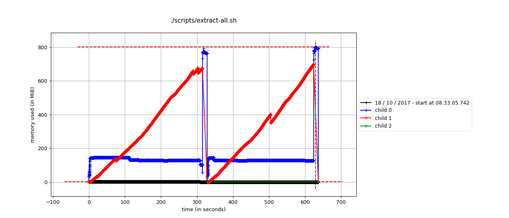
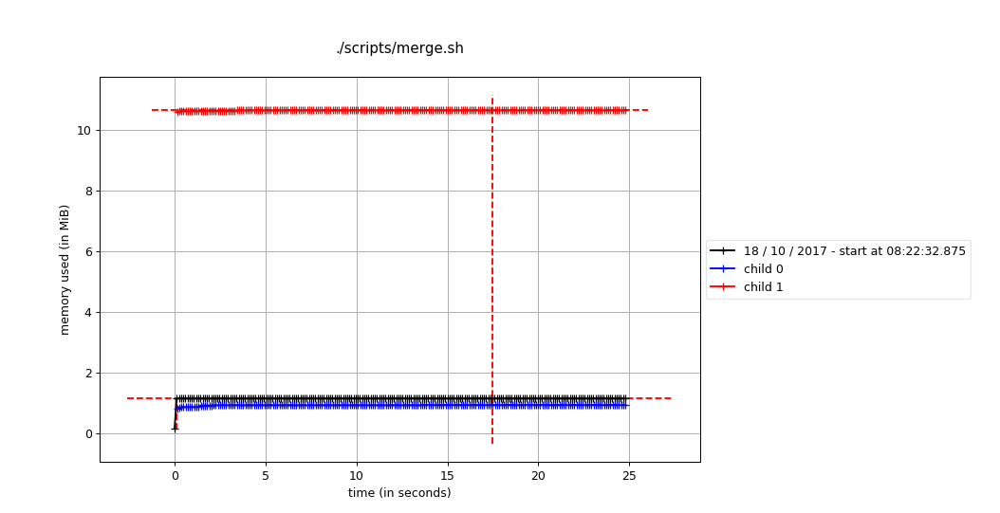
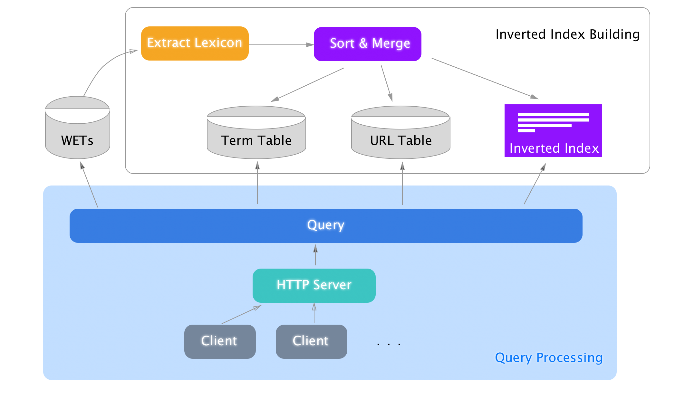
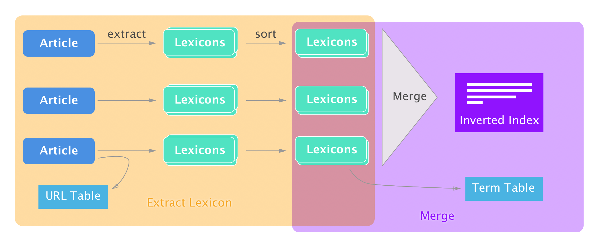

   

# Not Google

A Web Search Engine that is not google.


### Table of contents
* [Introduction](#introduction)
* [Features](#features)
    * [All](#all)
    * [Inverted Index Building](#inverted-index-building)
    * [Query Processing](#query-processing)
* [How to run](#how-to-run)
  * [Requirements](#requirements)
  * [Installation](#installation)
    * [Recommand for running](#recommand-for-running)
      * [Virtual env](#virtual-env)
  * [Use pre-built Inverted Index](#use-pre-built-inverted-index)
    * [Files](#files)
    * [Download](#download)
    * [Usage](#usage)
  * [Build Inverted Index](#build-inverted-index)
    * [Example usage](#example-usage)
      * [Download wet files](#download-wet-files)
      * [Lexicon Extraction stage](#lexicon-extraction-stage)
      * [Sort Merging stage](#sort-merging-stage)
    * [Actual usage](#actual-usage)
    * [More options](#more-options)
    * [Notes on Running on Servers](#notes-on-running-on-servers)
      * [HPC](#hpc)
        * [Load Python 3 module](#load-python-3-module)
  * [HTTP Server](#http-server)
    * [Usage](#usage)
      * [Supported Commnads](#supported-commnads)
* [Benchmark & Statistics](#benchmark-&-statistics)
  * [Speed](#speed)
    * [Lexicon Extraction](#lexicon-extraction)
      * [Full mode](#full-mode)
      * [No Chinese mode](#no-chinese-mode)
      * [Dumb mode](#dumb-mode)
    * [Merging and Sorting](#merging-and-sorting)
    * [Query](#query)
      * [Cached Result](#cached-result)
      * [Single Query](#single-query)
      * [Conjuctive Query](#conjuctive-query)
      * [Disjuctive Query](#disjuctive-query)
  * [Size](#size)
  * [Memory for ii Build](#memory-for-ii-build)
* [How it works](#how-it-works)
  * [Structure](#structure)
    * [Overall structure](#overall-structure)
    * [Inverted Index Building](#inverted-index-building)
    * [Query Processing](#query-processing)
      * [Query](#query)
  * [File Structure](#file-structure)
    * [URL Table](#url-table)
    * [Term Table](#term-table)
  * [Query Efficiency](#query-efficiency)
  * [Ranking](#ranking)
    * [BM25](#bm25)
    * [Precomputed impact score](#precomputed-impact-score)
  * [Snippet generation](#snippet-generation)
  * [Chinese Query](#chinese-query)
    * [Chinese Snippet Length Budget](#chinese-snippet-length-budget)
  * [Design patterns](#design-patterns)
    * [List Comprehention](#list-comprehention)
    * [Defered result](#defered-result)
  * [Questions](#questions)
    * [Inverted Index](#inverted-index)
    * [Query](#query)
    * [Other](#other)
  * [Other open source library](#other-open-source-library)
* [Future Work](#future-work)
  * [Complex Query](#complex-query)
  * [Distributed](#distributed)
    * [Multi Stage Approrach](#multi-stage-approrach)
    * [UUID approach](#uuid-approach)
  * [Speed up](#speed-up)
* [Limitations](#limitations)
* [Development](#development)


# Introduction

This project build a text based web search engine for a subset of the internet (~ 1/300 the living public crawlable internet). The purpose of a web search engine is to allow fast and effective information retrival on large amount of data that living on a web.

This project focuses on two main companent that makes a working text based web search engine: Inverted Index building and Query Processing. Inverted Index Building are futher devided into two stages: Lexicon Extraction stage and Merge & Sort stage.


# Features

### All

* Language detection
* 7 languages support including Chinese (English, French, Germany, Italian, Latin, Spanish, Chinese)

### Inverted Index Building

* Binary I/O and Stroage
* Progress & Speed display
* Impact Score precomputation
* Compressed Inverted Index using Blockwise varbyte 

### Query Processing 

* Mordern Web Browser Based Responsive UI (Desktop and Mobile)
* Conjuntive & Disjunctive Query
* Automatic Conjuntive or Disjunctive discovery 
* Smart Snippet Generation
* Paging support
* Fast and low cost query based on Impact Score and memory efficient design pattern and index-guessing
* Speed up via Multilayer Cache Support 
* Live module reload and cache usage report

# How to run
## Requirements
* Linux/ macOS/ OS with GNU tools
* Python 3.5+
* MongoDB 
* Redis 

## Installation
Please consider the [Recommand for running](#recommand-for-running) section before  Installation. 

If you insist to install directly without virtual environment, It will be okey.

``` bash
$ pip install -r requirements.txt
```
Notice you **have to** use the packages specified in `requirements.txt`, since there are some packages, though using the same import name in python headers, they use different packages than commonly used ones. Those packages are specialized for this project, and support for extra feature they originally don't have.

### Recommand for running
It is recommanded to use virtual environment for python packages to avoid package conflicts.
#### Virtual env
For the first time of for this project, start a new venv from as:

``` bash
$ pyvenv .env
```

And then or for later use, activate it:

``` bash
$ source .env/bin/activate
 # For the first time:
$ pip install -r requirements.txt
```

## Use pre-built Inverted Index
### Files
There are 4 files that is required before Query process to run :
``` coffeescript
- docIDwet.tsv
- inverted-index-300-with-score.ii
- mongo-dump.zip
- redis-dump.rdb
```
### Download
These files are available at AWS for download:
``` 
https://s3.amazonaws.com/not-google/Inverted-Index/docIDwet.tsv
https://s3.amazonaws.com/not-google/Inverted-Index/inverted-index-300-with-score.ii
https://s3.amazonaws.com/not-google/Inverted-Index/mongo-dump.zip
https://s3.amazonaws.com/not-google/Inverted-Index/redis-dump.rdb
```
### Usage
Put `docIDwet.tsv` and `inverted-index-300-with-score.ii` into `./data/` dir as they are configured in `config.ini` by default.
Unzip `mongo-dump.zip` and use `mongorestore` to restore into MongoDB.
Put `redis-dump.rdb` into redis storage location and restart redis to load DB. Redis storage location can be found at:
``` bash
$ redis-cli
> config get dir
1) "dir"
2) "/usr/local/var/db/redis" <- # Here 
```


## Build Inverted Index
The running of the whole inverted index building has been devided into 3 parts:
* Download wet files
* Lexicon extraction
* Sort Merging 

For the first **Lexicon extraction** stage, use python script `extract_lex`, and for **Sort Merging** stage use `merge.py`

### Example usage
#### Download wet files
``` bash
$ ./scripts/dl.sh 300 
```
This will download `100` wet files to `data/wet`. (change `100` to get more or less)
#### Lexicon Extraction stage
``` bash
$ python extract_lex.py --urlTable "data/url-table.tsv" data/wet/*.warc.wet.gz | sort > "data/all.lex" 
```
This will extract all lexicons (that in language English, French, Germany, Italian, Latin, Spanish and Chinese) from the `wet` files in `data/wet/`, and write the sorted lexicons to `data/all.lex`.
#### Sort Merging stage
``` bash
$ cat  "data/all.lex" | python merge.py > "data/inverted-index.ii"
```
This will read all **sorted** lexicons, merge them into inverted lists and write to `data/inverted-index.ii`.
### Actual usage
Example usage is not practical when you wants to:

* Run on many wet files
* Use binary for performance boost

So there are smarter version provided for these needs:

``` bash
 # extract all wet files in `data/wet`
$ ./scripts/extract-all.sh 
* Dealing: data/wet/CC-MAIN-20170919112242-20170919132242-00000.warc.wet.gz
Building prefix dict from the default dictionary ...
Loading model from cache /var/folders/dy/dh2zyqj93fg72s9z4w2tnwy00000gn/T/jieba.cache
Loading model cost 0.828 seconds.
Prefix dict has been built succesfully.
40919records [05:00, 136.23records/s]
...
$ ./scripts/merge.sh
```
`extract-all.sh` will individually extract and sort lexicons into fex files to `data/lex`.

`merge.sh` will take all **sorted** lex files and merge them into the final ii file `data/inverted-index.ii`.

All oprations are done in binary.

### More options
More options over `extract_lex.py` can be fetched help:

``` bash
$ python extract_lex.py -h
usage: extract_lex.py [-h] [-b] [-s <number>] [--skipChinese] [-T <filepath>]
                      [--bufferSize <number>] [-u] [-c]
                      <filepath> [<filepath> ...]

Extract Lexicons from WETs

positional arguments:
  <filepath>            path to file

optional arguments:
  -h, --help            show this help message and exit
  -b, --binary          output docID as binary form
  -s <number>, --startID <number>
                        docID Assigment starting after ID
  --skipChinese         if set, will not parse chinese words
  -T <filepath>, --urlTable <filepath>
                        if set, will append urlTable to file
  --bufferSize <number>
                        Buffer Size for URL Table Writing
  -u, --uuid            use UUID/ if not specified, use assign new ID mode
  -c, --compressuuid    compress UUID in a compact form, only valid in UUID
                        mode
```
Note that `uuid` isn't tested for use. It was built for compatibity of ditributed system. 


### Notes on Running on Servers
Scripts are created for copying necessary exectables to server. Use of example:

``` bash
$ ./scripts/deploy.sh user@server:path
```

#### HPC
Distributed version of this II building program is not completed, you will not be able to use it on Hadoop or Spark or Hive. However you could use HPC as ordinary server to run the program. 

There were works done for prepration of this program to be distributable. Please read [Future Work > Distributed](#distributed) section.

##### Load Python 3 module

```bash
$ module load python
```

## HTTP Server

``` bash
$ python query_http.py
```

Result:


### Usage 

Use like `keyword1 keyword2` delimited using space are automaticlly determined as conjuctive or disjuctive query.

To forcibliy use disjuective query, use `|` as a delimiter.


Also type ":command" for commands:

#### Supported Commnads

```
:reload
:cache
:cache-clear
```


# Benchmark & Statistics

The following tests are done using Macbook Pro 2016 Laptop
## Speed
### Lexicon Extraction

#### Full mode

(Language detect on, Chinese on, binary)

``` bash
$ python extract_lex.py --binary data/wet/* > "data/delete-this.log"
```
~ 136 records/s

~ 5 mins/wet

#### No Chinese mode

(Language detect on, Chinese off, binary)

``` bash
$ python extract_lex.py --binary --skipChinese data/wet/* > "data/delete-this.log"
```
~ 166 records/s

~ 4 mins/wet

#### Dumb mode

(Language detect off, Chinese off, binary)

``` bash
$ python extract_lex.no_language.py --binary data/wet/* > "data/delete-this.log"
```
~ 513 records/s

~ 1.3 min/wet

Speed is significantly faster however in this mode search result is going to be farily bad, beacuse all languages are jammed together. And for non-latin language it's even un-searchable.

### Merging and Sorting
``` bash
$ ./scripts/merge.sh 
```
~ $113k$ lines/s (for input)

~ $52k$ inverted lists/s (for output)

~ $13$ s/wet (including Chinese words)

###  Query

The following test are runing on 300 WET files, containing 8,521,860 docs , 49,387,974 unqiue terms, 4,151,693,235 total inverted term items.

#### Cached Result

|  Results  | Query |       Time       |
| :-------: | :---: | :--------------: |
|  167,788  | "cat" | 0.000512 seconds |
| 2,709,827 |  "0"  | 0.000334 seconds |
| 5,872,440 | "to"  | 0.000630 seconds |

#### Single Query

|  Results  | Query |     Time      |
| :-------: | :---: | :-----------: |
|  167,788  | "cat" | 0.573 seconds |
| 2,709,827 |  "0"  | 8.44 seconds  |
| 5,872,440 | "to"  | 19.6 seconds  |

#### Conjuctive Query

| Results |        Query         |      Time      |
| :-----: | :------------------: | :------------: |
|   306   |      "cat dog"       | 0.0458 seconds |
|  1,145  | "to be or not to be" | 0.275 seconds  |
|  1,423  |        "8 9"         | 0.0998 seconds |

#### Disjuctive Query

|  Results  |      Query      |     Time     |
| :-------: | :-------------: | :----------: |
|  168,398  | "armadillo cat" | 1.27 seconds |
|  286,334  |   "cat\|dog"    | 2.24 seconds |
| 3,013,008 |   "why\|not"    | 25.3 seconds |


## Size

* 300 WET files

* 8,521,860 docs

* 49,387,974 unqiue terms

* 4,151,693,235 total inverted term items.

* 18G generated ii file

* ~ $364$  byte/inverted list 

* ~ $2.7k$ inverted lists/MB

* 3.5G Term Table for Storage

* 1.3G Term Table Index Size

* 0.9G URL Table  for Storage

* 3.0G URL Table Memory Size

* ~5 Hour for `Lexicon Extraction` stage using parallel rebuiding method

* ~10 Hours for `Sort and Merge` stage

  ​


## Memory for ii Build

Depends on buffer size, for default


|      Lexicon Extraction (and sort)       |                  Merge                   |
| :--------------------------------------: | :--------------------------------------: |
|                  <1GiB                   |                 < 15MiB                  |
|  |  |

The memory usage are mostly used by GNU Unix Sort, by default GNU Unix Sort would take 80% of system, after that sort would use temprary file to store them.

Luckily mordern computers has a memory typically much greater than 1GiB. So as long as the wet file size maintain as the current scale, this would't be a problem. 

(In other words, on very low memory computers,  it might slow down. )


# How it works

## Structure 

### Overall structure



### Inverted Index Building

Detailed ` Inverted Index Building` Structure explaining what `Extract Lexicon` and `Merge` do.



### Query Processing

Queries are first detected as Normal Queries or Commands. For Normal Queries, they are processed using Query (query,py). 

#### Query

Query => Language Dectection => Term reformation => Automatic Disjuction/Conjuction Detection => Disjuction/Conjuction/Single Query 

Disjuction/Conjuction/Single Query => BlockReader ~> BM25 ~> filter => Sinippet => Meta Info Collection => Return


Note: `~>` means it's done in memery efficient way, they are stream-like process.


## File Structure

``` bash
  ├── README.md  # This file source code
  ├── README.pdf # This file
  ├── config.ini # Configration file
  ├── data/
  │   ├── docIDwet.tsv      # (generated) File Index of WET
  │   ├── expect_terms.tsv  # (generated) For process estimate of ii-build merge stage
  │   ├── inverted-index.ii # (generated) final Inverted List 
  │   ├── lex/				# (generated, ii-build) intermediate lexicons Files
  │   │   ├── CC-MAIN-20170919112242-20170919132242-00000.lex
  │   │   └── ...
  │   ├── url-table-table.tsv # (generated, deprecated) Index of URL Table
  │   ├── url-table.tsv		  # (generated, deprecated) URL Table
  │   ├── wet/				  # (downloaded, uncompressed) WET Files
  │   │   ├── CC-MAIN-20170919112242-20170919132242-00000.warc.wet
  │   │   └── ...
  │   └── wet.paths			  # WET Files URLs
  ├── decode-test.py		  # (ii-build) Test code for lexicon file verification
  ├── extract_lex.no_language.py # (ii-build) Dumb mode version of `extract_lex.py`
  ├── extract_lex.py		  # (ii-build) main file for `Lexicon Extraction`
  ├── index.html              # client side index html
  ├── merge.py				  # (ii-build) main file for `Merge`
  ├── miscellaneous/		  # miscellaneous files
  │   ├── ...
  │   ├── deprecated/
  │   │   ├── extract.sh*
  │   │   ├── hadoop-test.sh*
  │   │   ├── map-reduce-test.sh*
  │   │   └── setup-env.sh*
  │   ├── dumbo-sample.sh*
  │   └── testbeds/
  │       └── ...
  ├── modules/				  # Modules
  │   ├── BM25.py				# (query) BM25 computation
  │   ├── BlockReader.py		# (query) High level Blockwized II Reader
  │   ├── Heap.py				# (query) Customized Data Structures
  │   ├── IndexBlock.py			# (query, ii-build) Blockwized II Reader and Writer 
  │   ├── LexReader.py			# (query) WET file reader
  │   ├── NumberGenerator.py  	# (ii-build) binary compatible docID generator 
  │   ├── Snippet.py			# (query) snippet generation 
  │   └── query.py				# (query) main Query process
  ├── query_cmd.py			  # (query, deprecated) cmd line interface for query processing
  ├── query_http.py			  # (query) HTTP interface for query processing
  ├── requirements.txt		  # requirement for python dependencies
  └── scripts/
  │   ├── deploy.sh*		  # (ii-build) helper script for deploy 
  │   ├── dl.sh*			  # (ii-build) helper script for download
  │   ├── expect_terms.sh*    # (ii-build) `expect_terms.tsv` generator
  │   ├── extract-all.sh*	  # (ii-build) main script for `Lexicon Extraction`
  │   ├── extract-doc-parallel.sh* # (ii-build) parallel URL Table Rebuilder
  │   ├── generate_toc.rb*	  # (ii-build) helper script for markdown ToC generation
  │   └── merge.sh*			  # (ii-build) main script for `Merge`
  └── static/				# Static files to server client
    ├── lib/				# library used
    │   └── ...
    ├── main.js				# main js file
    └── style.css			# main css file

```

### URL Table

URL Table are stored in memory using Redis.

Data schema is as:

``` json
"docID":{
  "url" : URL of docID (redundant)
  "lang": langauge of document
  "len" : length of document in terms
  "off" : offset in WET file
}
```


### Term Table

Term Table are stored on disk cached by memery using MongoDB.

Data schema is as:

```json
{
  "term": term text in binary
  "count" : total term occrance
  "off" : offset in ii file
  "begins" :[
  	# begin docIDs in block
  ]
  "idOffs" : [ # docID offset in ii file
  	( offset , length), 
  	...
  ]
  "tfOffs" : [ # text frequnancy offset in ii file
  	( offset , length), 
  	...
  ]
  "bmOffs" : [ # impact score offset in ii file
  	( offset , length), 
  	...
  ]
}
```


## Query Efficiency

Several techniques has been used to speed up and reduce memery usage in query
*  Precomputed impact score (see [Ranking>BM25](#Precomputed impact score)) has reduced live ranking score compution to 100x times on large query result
*  Design pattern: Defered result   (see [Design patterns](#Defered result))
*  Index guessing for wet files

As wet file and docID grows, searching for a specific wet file may take longer time as for each query may call multiple times of them at least. Thus Index guessing are used to speed up the time to find which wet file are to read for a given docID.

Index guessing are done in very simple algorithm: $$\frac{docID}{|\text{WET}|_{docIDs, avg}}$$

as docID are assigned in order of WET files.


## Ranking

### BM25

Result to return for a given query are mainly base on ranking BM25.

$$BM25(d, Q) =\sum_{t\in Q}IDF(t) \times \frac{f_{d,t}}{K_d+f_{d,t}}\times (k_1+1)$$

where $$ IDF(t) = log\frac{N-n_t+0.5}{n_t+0.5}$$

and $$K_d = k_1 \times (1-b+b\times \frac{|d|}{|d|_{avg}})$$

### Precomputed impact score 

We can easily know that $\frac{f_{d,t}}{K+f_{d,t}}$ can be precomputed.

Since $\frac{f_{d,t}}{K+f_{d,t}} \in [0,1)$ ,

In order to store them in ii file efficiently, linear quntization is used:

$$\left \lfloor c\times \frac{f_{d,t}}{K+f_{d,t}} \right \rfloor$$

where $c=2^{(8-1)\times2}=16384$.

Chosing $c=2^{(8-1)\times2}$  dues to support for large resolution and varbyte encoding in max of 2 bytes.

A better solution would be $c=2^8=256$ to use a smaller resolution and fix-byte encoding as they would store always in 1 byte, however decisiton has been made and precomputation is running at the time it has to be done for later stages.


## Snippet generation

Snippet are generated based on ranking of aggregation of terms based on a certain result budget (typicaly 3).

The more different terms aggregatation occurs in a line of text (a paragrah or a sentence), the more they are ranked.

If the overall ranking score doesn't go well in above process, it tries to find a longer Length Snippet instead of 3.


## Chinese Query

Chinese query are detected first when the query comes in.

They are dealed dfferently in two main parts:

* chinese query are done 
* Chinese query has different Snippet length budget 


### Chinese Snippet Length Budget

As 

* English avg word length = 5.1
* Chinese avg word length = 1.4~1.65
* Chinese charactor size  = 2

Thus we have $\frac{5.1/1.65}{2} = 1.54$ times English Snippet Length Budget as Chinese Snippet Length Budget.


## Design patterns

In query processing, the following design patterns are widely (ranking, snippet, etc) used to achieve effiency in both time and memory.

### List Comprehention 

This is a concept that is very close to lambda expression in many other languages than python.

When It's used, variable constrction time among with other replicative costs are reduced to improve overall execition speed.

### Defered result

Defeted result make stream-like process possible. 

In python, keyword `yield` create a `yielding` object that may defer result from where it's called. In combination with list comprehention and iterable, it would produce the real result only on final iteration.

A dedicated data structure `FixSizedHeap` is commonly used in this project to catch defered result, as the memory would be limited to the size of the Heap, as well keeping a ordered result for certain priority (think of BM25). 

To be specific `sliding window` in Snippet and `Disjuctive/Conjuctive Block Reader` for ii file are designed using this method.


## Questions

### Inverted Index

> Why inverted index building so slow?

Because Language Detect and Chinese Word Seperate uses HMM model (pre-trained) to compute. They are computational intensive.


> How much docIDs are supported? Why?

In short: ~2 billion.

The binary encoding entroy used for docID generation was $(256-3) = 253$ out of $256$ per byte.

The number of encoding bytes are chosen for $4$ as default so there would be $(256-3)^3 \times (128-3)-2 = 2,024,284,623 \approx 2 \text{ billion}$  documents supported.


> Why $-3$ ?

The $-3$ was for `\t` `space` and `\n`  3 different kinds of seperation characters.
Those characters are used to seperate words document IDs frequency and future added features.

Compare with plain text number entroy $10$ out of $2^8=256$, $2^8-3$ is a much better figure.


> Why unix sort?

Unix sort is incredibaly fast and supports streaming.

The encoding had been paid much care to support using unix sort.


> Is Unix Sort ok?

They are, as long as you treat the stram as binary, I set flag `LC_ALL=C` to do that.


> Why encode docID in binary form not Text Frequncies (IF)?

Because **most** TF are below 10. They take up 1 byte to store. Thus using binary form for it **won't benifit** much.

Hence designing and **computing** each time when accessing an encoding that convert to and from number would both take more time.


> Why Merge Stage take so little memory ?

Beacuse the design of `merge.py` has take as much advantage of streaming as possible. 

It doesn't wait till an Inverted List is completed to unload memory, it streams out all `doc Item` as long as they get them.


### Query

> What is the standard of judging  Conjunctive or Disjunctive Query? 

In general, when there are expected small amount of results, it's considered disjunction.

See `./modules/query.py` line `111` for detailed infomation.


> What is the standard of being a good snippet ranking before it fallbacks to single snippet?

See `./modules/Snippet.py` line `52` `53` for more infomation.


> What's cached? How they are cached?

* Inverted List Blocks
* Query Results
* Term Table items
* URL Table items

They are cached in memery in last recent used manner.


### Other

> Why not C++

Beacuse packages on high level langauges are richer than C++.

If effiecency is the convern, there are language that are close to C++ level of proformance  e.g. Swift, Go 


## Other open source library

This project had been use a modified python package  `warc` . It has been modified to support reading and fast lookup`wet`  files to adapt to this project 
(check [warc3-wet](https://github.com/Willian-Zhang/warc3) ). 

During this project , a request has been made to fix an deprecation probem.
(check [Pull Request](https://github.com/utahta/pyvbcode/pull/1) (Japanese) )


# Future Work 

There are several works can be done easily but requires more careful thoughts

## Complex Query

Support for more complicated query like combinations of conjunction and disjunction.

A parsor may be requried for complex query syntax.

 

## Distributed

### Multi Stage Approrach

An parallel version of Lexicon Extracion has been implemetend based on previous result of `docIDwet.tsv `. 

It speed up 5x to the previous run. 

This gives a hint on spliting current Lexicon Extracion to 2 parsing stages for runnning: One for generating docID. The other for distributed detailed care taken Lexicon Extraction for each WET file, for a given starting number of docID.


### UUID approach

The whole program is written in a `Map and Reduce` concept. They can be easily ported to Hadoop MapReduce. Here is a list of what has been done:

* Python package distribution with virtual env support using Hadoop
* UUID and UUID compression support (higher entroy encoding for UUID)

And what to be done is:

* Map Reduce compatiple URLTable Generation
* Glue code to pipe them all


Considering Hadoop Stream isn't actually efficient, Spark would be a good replacement for that, though how to port `Language Detection ` and `Chinese Support` to Scala and Spark.


## Speed up

- Change a language like `Go` might incredibaly speed up exection. (But packages?)

- `IDF` calculations may also be pre-computed.

  ​

# Limitations

Conjunction/Disjunction not smart enough.

Query speed is still a problem for very large query result. Why not pre-sort inverted lists so that it's not nessary to parse all item in inverted list?


# Development
Add new requirements if new python packages are used

``` bash
$ pip freeze > requirements.txt
```

If to Change of README.md file. There is a ruby script to build Markdown Table of Content:

``` bash
$ ruby scripts/generate_toc.rb
```
