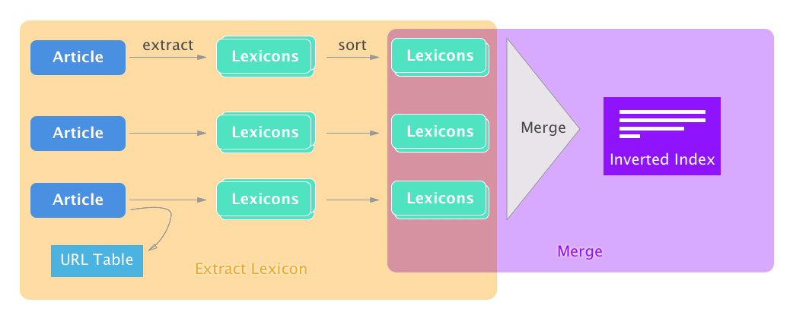

# Inverted Index (II)
Build Inverted Index upon wet file

### Table of contents
* [Features](#features)
* [How to run](#how-to-run)
  * [Requirements](#requirements)
  * [Installation](#installation)
    * [Recommand for running](#recommand-for-running)
      * [Virtual env](#virtual-env)
* [For the first time:](#for-the-first-time:)
  * [Usage](#usage)
    * [Example usage](#example-usage)
      * [Download wet files](#download-wet-files)
      * [Lexicon extraction](#lexicon-extraction)
      * [Sort Merging](#sort-merging)
    * [Actual usage](#actual-usage)
* [extract all wet files in `data/wet`](#extract-all-wet-files-in-`data/wet`)
    * [More options](#more-options)
  * [Notes on Running on Servers](#notes-on-running-on-servers)
    * [HPC](#hpc)
      * [Load Python 3 module](#load-python-3-module)
* [How it works](#how-it-works)
  * [Questions](#questions)
* [Benchmark](#benchmark)
* [Future Work](#future-work)
  * [Distributed](#distributed)

# Features
* Language detection
* Chinese support along with latin-charactor based languages
* Binary I/O and Stroage
* Progress & Speed display
* Text Frequncy (TF) in documents

# How to run
## Requirements
* Python 3.4+

## Installation
Please consider the [Recommand for running](#recommand-for-running) section before  Installation. 

If you insist to install directly, It will be okey.

``` bash
$ pip install -r requirements.txt
```

### Recommand for running
It is recommanded to use virtual environment for python packages to avoid package conflicts.
#### Virtual env
For the first time of for this project, start a new venv from as:

``` bash
$ pyvenv .env
```

And then or for later use, activate it:

``` bash
$ source .env/bin/activate
# For the first time:
$ pip install -r requirements.txt
```


## Usage
The running of the whole inverted index building has been devided into 3 parts:
* Download wet files
* Lexicon extraction
* Sort Merging 

For the first **Lexicon extraction** stage, use python script `extract_lex`, and for **Sort Merging** stage use `merge.py`

### Example usage
#### Download wet files
``` bash
$ ./scripts/dl.sh 100 
```
This will download `100` wet files to `data/wet`. (change `100` to get more or less)
#### Lexicon extraction
``` bash
$ python extract_lex.py --urlTable "data/url-table.tsv" data/wet/*.warc.wet.gz | sort > "data/all.lex" 
```
This will extract all lexicons (that in language English, French, Germany, Italian, Latin, Spanish and Chinese) from the `wet` files in `data/wet/`, and write the sorted lexicons to `data/all.lex`.
#### Sort Merging
``` bash
$ cat  "data/all.lex" | python merge.py > "data/inverted-index.ii"
```
This will read all **sorted** lexicons, merge them into inverted lists and write to `data/inverted-index.ii`.
### Actual usage
Example usage is not practical when you wants to:

* Run on many wet files
* Use binary for performance boost

So there are smarter version provided for these needs:

``` bash
# extract all wet files in `data/wet`
$ ./scripts/extract-all.sh 
* Dealing: data/wet/CC-MAIN-20170919112242-20170919132242-00000.warc.wet.gz
Building prefix dict from the default dictionary ...
Loading model from cache /var/folders/dy/dh2zyqj93fg72s9z4w2tnwy00000gn/T/jieba.cache
Loading model cost 0.828 seconds.
Prefix dict has been built succesfully.
40919records [05:00, 136.23records/s]
...
$ ./scripts/merge.sh
```
`extract-all.sh` will individually extract and sort lexicons into fex files to `data/lex`.

`merge.sh` will take all **sorted** lex files and merge them into the final II file `data/inverted-index.ii`.

All oprations are done in binary.

### More options
More options over `extract_lex.py` can be fetched help:

``` bash
$ python extract_lex.py -h
usage: extract_lex.py [-h] [-b] [-s <number>] [--skipChinese] [-T <filepath>]
                      [--bufferSize <number>] [-u] [-c]
                      <filepath> [<filepath> ...]

Extract Lexicons from WETs

positional arguments:
  <filepath>            path to file

optional arguments:
  -h, --help            show this help message and exit
  -b, --binary          output docID as binary form
  -s <number>, --startID <number>
                        docID Assigment starting after ID
  --skipChinese         if set, will not parse chinese words
  -T <filepath>, --urlTable <filepath>
                        if set, will append urlTable to file
  --bufferSize <number>
                        Buffer Size for URL Table Writing
  -u, --uuid            use UUID/ if not specified, use assign new ID mode
  -c, --compressuuid    compress UUID in a compact form, only valid in UUID
                        mode
```
Note that `uuid` isn't tested for use. It was built for compatibity of ditributed system. 


## Notes on Running on Servers
Scripts are created for copying necessary exectables to server. Use of example:

``` bash
$ ./scripts/deploy.sh user@server:path
```

### HPC
Distributed version of this II building program is not completed, you will not be able to use it on Hadoop or Spark or Hive. However you could use HPC as ordinary server to run the program. 

There were works done for prepration of this program to be distributable. Please read [Future Work > Distributed](#distributed) section.

#### Load Python 3 module

```bash
$ module load python
```

# Benchmark
The following tests are done using Macbook Pro 2016 Laptop
## Speed
Sorting and merging speed are significently low compared to `lexicon extraction`.

So the testing are mostly about `lexicon extraction`.

### Full mode
(Language detect on, Chinese on, binary)

``` bash
$ python extract_lex.py --binary data/wet/* > "data/delete-this.log"
```
~ 136 records/s
~ 5 mins/wet
### No Chinese mode 
(Language detect on, Chinese off, binary)

``` bash
$ python extract_lex.py --binary --skipChinese data/wet/* > "data/delete-this.log"
```
~ 166 records/s
~ 4 mins/wet

### Dumb mode 
(Language detect off, Chinese off, binary)

``` bash
$ python extract_lex.no_language.py --binary data/wet/* > "data/delete-this.log"
```
~ 513 records/s
~ 1.3 min/wet

Speed is significantly faster however in this mode search result is going to be farily bad.

### Merging and Sorting
``` bash
$ ./scripts/merge.sh 
```
~ $530k$ lines/s (for input)
~ $52k$ inverted lists/s (for output)
~ $13$ s/wet (including Chinese words)

## Size

~ $15k$  inverted lists/MB

``` bash
# count line using:
cat "data/inverted-index.ii" | wc -l
```


# How it works


## Questions
> Why so slow?

Because Language Detect and Chinese Word Seperate 
> How much docIDs are supported? Why?

In short: ~2 billion.

The encoding binary encoding entroy used for docID generation was $(256-3) = 253$ out of $256$ per byte.

The number of encoding bytes are chosen for $4$ as default so there would be $(256-3)^3 \times (128-3)-2 = 2,024,284,623 \approx 2 \text{ billion}$  documents supported.

> Why $-3$ ?

The $-3$ was for `\t` `space` and `\n`  3 different kinds of seperation charactors.
Those charactors are used to seperate words document IDs frequency and future added features.

> Is Unix Sort ok?

They are, as long as you treat the stram as binary, I set flag `LC_ALL=C` to make it work.

> Why encode docID in binary form not


# Future Work 
## Distributed

# Development
Add new requirements if new python packages are used

``` bash
$ pip freeze > requirements.txt
```

If to Change of README.md file. There is a ruby script to build Markdown Table of Content:

``` bash
$ ruby scripts/generate_toc.rb
```